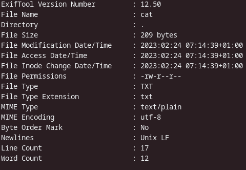

exif-Daten sind Metadaten die Informationen über eine Datei enthalten. Das kann sehr nützlich sein, denn so lassen sich Dinge herausfinden, die man so nicht sehen kann. Bei Bildern kann man so also nachvollziehen, wann, wo und mit welcher Konfiguration das Bild gemacht wurde.

Grundsätzlich ist es nichts schlechtes Daten mitzuschreiben, auch wenn das in der Privatsphäre Szene oft so rüberkommt. Das Problem ist nur wenn andere Parteien auf die mit geschrieben Daten Zugriff haben. Zum Beispiel ist auch der Suchverlauf im Browser sehr nützlich und ich lösche ihn nur selten, denn wenn ich mich daran erinnere, dass ich schon einmal etwas gesucht habe, dann kann ich so schneller sinnvolle Ergebnisse finden. Das gleiche gilt auch für andere logs wie die Geschichte deiner shell. Das sind alles sehr private Daten, die ich freiwillig mit schreibe. Aber das mache ich in dem Wissen, dass ich der einzige bin der darauf Zugriff hat. Dann stellt das ja keinerlei Sicherheitsrisiko dar.

Allerdings stellen solche Daten durchaus ein Risiko dar, wenn man Dateien teilt. Vor allem bei Bildern enthalten die Metadaten viele Informationen die nicht öffentlich sein sollten. Das Problem hier ist, dass das Wissen über diese Daten nicht sehr verbreitet ist. Es ist aber sehr einfach sie auszulesen und auch zu entfernen. 

Einige sozialen Medien sind sich dessen aber bewusst und entfernen die Metadaten, bevor sie die Bilder der Öffentlichkeit zeigen. 

## Auslesen

Auf linux gibt es ein sehr praktisches commandline-tool, welches es einem ermöglicht die Metadaten von  Dateien einzusehen, zu bearbeiten und zu löschen.

Es heißt einfach exif-tool, kann in einigen Repos verschieden benannt sein. (AUR: ``perl-image-exiftool``).

*die Metadaten einer normalen Textdatei*

Das ist nicht so kritisch, aber bei Bildern können auch GPS-Tags enthalten sein. Oder auch die genutzte Kamera, das Bearbeitungsprogramm und so weiter.

Aber mit dem Tool kann man wie gesagt auch entfernen. Aber die Daten, die auch bei der Textdatei sind bleiben erhalten, denn sie sind für das System relevant. Sie enthalten aber keine personenbezogenen Daten. 

---

## 52posts

Dieser Beitrag ist Teil meines Plans, in 2023 jede Woche einen Post zu erstellen, mit Dingen, die ich gelernt habe. (Das sind dann 52 Posts).

[#52posts](/tag/52posts)
