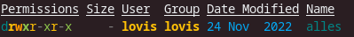

# -rwxr--r-- 1 lovis lovis 665 21. Feb 17:25 ownership.txt

## Eigentumsrechte

Im Dateisystem von GNU/Linux wird immer spezifiziert, wem die Datei gehört und wer was damit machen darf.
Diese Berechtigungen kann man sehen, indem man ``ls -lh`` ausführt. Dabei bewirkt die "l"-Option, dass alle Informationen zu den Dateien und Ordnern gezeigt werden. Die "h"-Option ist optional, denn sie gibt nur an, dass die Zahlen in einer vom Menschen lesbaren Art und Weise dargestellt werden.

Die dann ausgegeben Informationen bestehen aus 8 Bestandteilen (die Überschrift ist ein beispielhafter Output). Das erste ist das aller erste Zeichen, in diesem Fall ist es ein "-". Es kann allerdings auch ein d sein. Der Bindestrich bedeutet, dass es eine Datei ist, wobei das "d" Ordner beschreibt. Die darauf folgenden Zeichen werde ich später genauer erläutern, denn um sie zu verstehen muss man erst die anderen Bestandteile verstehen. Darauf folgt ein Zähler für Verlinkungen, der für die Eigentumsrechte aber völlig irrelevant ist, daher werde ich ihn nicht weiter behandeln. Dann kommt der Eigentümer der Datei (oder des Ordners) und dann sie Eigentümergruppe. Der Benutzername wird also nicht zwei mal wiederholt, sondern die Datei gehört in diesem Fall nicht nur dem Nutzer lovis, sondern auch der Gruppe lovis. Dann kommt die Dateigröße in bytes und des Bearbeitungsdatum der Dateien, sowie der Dateiname bzw jeweils die Eigenschaften des Ordners. Die Buchstaben, die nach dem Bindestrich kommen geben an, was mit der Datei gemacht werden darf. das "r" bedeutet read, das "w" bedeutet write und das "x" bedeutet execute (und der Bindestrich bedeutet, dass diese Aktion nicht gestattet ist). Die ersten drei Zeichen geben die Berechtigungen für den Eigentümer an, das ist in diesem Fall rwx. Der Eigentümer darf mit der Datei also alles machen. Die nächsten drei Zeichen geben an was die Eigentümergruppe mit der Datei machen darf (hier also r-- (nur lesen)). Welche Berechtigungen andere Nutzer haben geben die letzten drei Zeichen an (hier auch wieder r--). (Der root Nutzer kann alle Dateien immer und in jeglicher Form verwalten)

Um diese Berechtigungen zu ändern nutzt man den ``chmod`` als root Nutzer. Der chmod Befahl hat zwei Modi, einerseits den absoluten Modus, in dem man die Berechtigungen mit Zahlenwerten Darstellt, und andererseits den symbolischen Modus, in dem man die Buchstaben nutzt, die auch der ls-Befehl ausgibt, um die Rechte zu vergeben. Ich finde, dass ersterer einfacher zu verstehen ist, daher werde ich diesen Weg beschreiben. Die angesprochenen Zahlen sind einfach der Binärcode der Berechtigungen. Keine Berechtigungen ist 0. Danach besteht die Zahl nur aus den Binärwerten der 3 verschiedenen Berechtigungen. -w- zum beispiel entspricht 010, also 2. Eine 7 vergibt also alle Rechte (rwx -> 111 -> 7). Der Befehl wird dann also mit drei Zahlenwerten (die Rechte für jede einzelne Gruppe (Eigentümer, Eigentümergruppe, andere Nutzer)). Wenn ich also allen alle Berechtigungen geben möchte ist der Befehl (als root Nutzer) ``chmod 777 ownership.txt`` (*-rwxrwxrwx 1 lovis lovis 665 21. Feb 17:25 ownership.txt*). Hierbei ist anzumerken, dass die Zahlen von 1 bis 3 kaum einen Nutzen finden, denn man kann nicht viel mit einer Datei anfangen, die man zwar bearbeiten oder ausführen kann, allerdings für einen nicht sichtbar ist. In manchen Fällen kann aber auch der andere Modus des Befehls nützlich sein, denn so kann man eine Aktion für alle Gruppen erlauben, ohne sich die Zahlen zu überlegen. Ein weit verbreitetes Beispiel dafür ist ``chmod +x``. Es fügt allen drei Gruppen die Erlaubnis die Datei auszuführen hinzu. Gleiches geht auch in die andere Richtung. Mit einem Minus kann man allen Gruppen eine Bestimmte Befugnis weg nehmen. 

Man kann aber auch die Eigentümer der Dateien ändern. Dafür nutzt man dann den ``chown`` Befehl (auch als root Nutzer). Hier ist die Benutzung sehr intuitiv. ``chown [neuer_Eigentümer]:[Neue_Eigentümergruppe] [Dateiname]`` (Nur eine Gruppe und nur ein Nutzeraccount kann eine Datei auf einmal besitzen).

| Nummer | Berechtigung |
| ------ | ------------ |
| 0      | ``---``      |
| 1      | ``--x``      |
| 2      | ``-w-``      |
| 3      | ``-wx``      |
| 4      | ``r--``      |
| 5      | ``r-x``      |
| 6      | ``rw-``      |
| 7      | ``rwx``      |

*Beispiel mit ``exa``*

---

## 52posts

Dieser Beitrag ist Teil meines Plans, in 2023 jede Woche einen Post zu erstellen, mit Dingen, die ich gelernt habe. (Das sind dann 52 Posts).

[#52posts](/tag/52posts)
