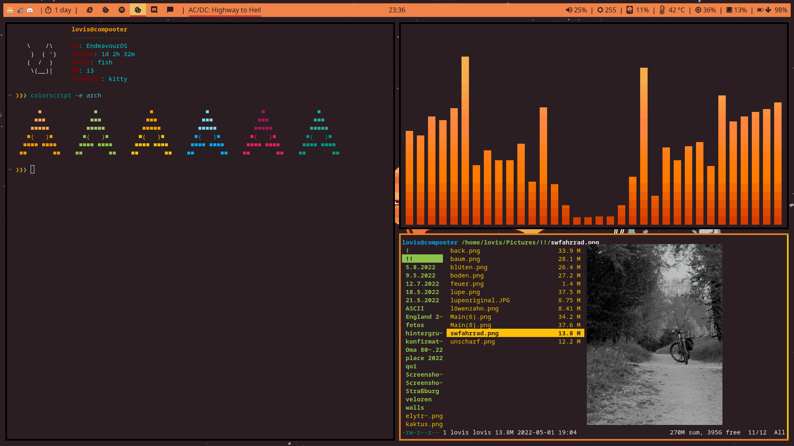
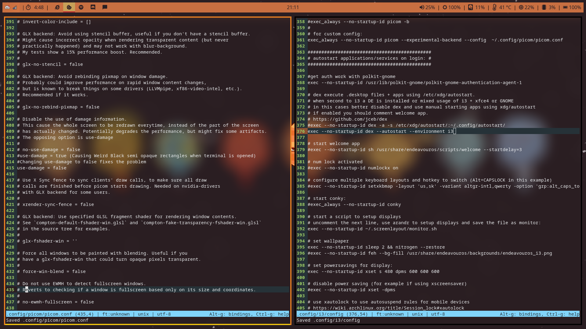
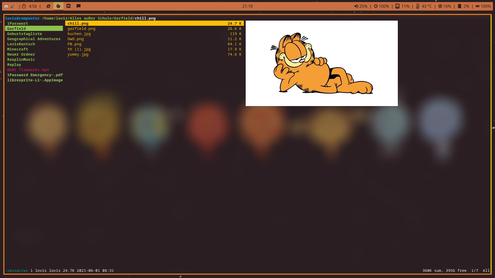
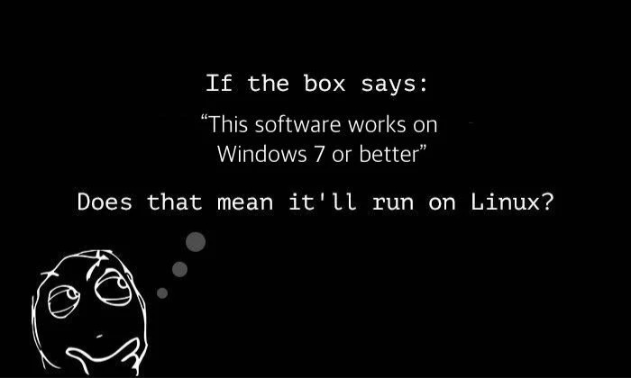
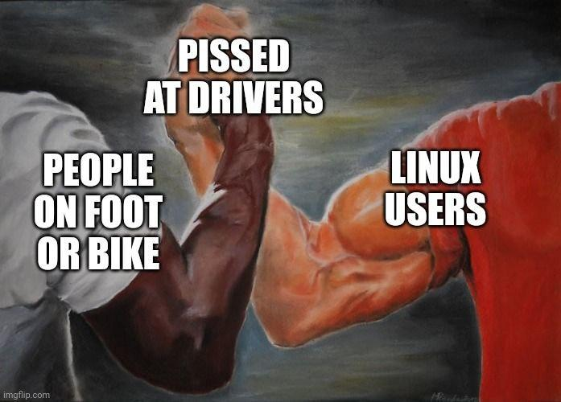

Linux ist ein Betriebssystem. Fast das gesamte Internet (also die Server) läuft auf Linux, Andriod basiert auf Linux. Aber es ist auch als Desktopbetriebssystem tauglich, sozusagen als Alternative zu Windows und MacOS.
Aber auch andere Systeme nutzen Linux, zum Beispiel router, IOT (zb. Smarthome Geräte), Spielkonsolen, Autos und auch Raketen.

Linux ist UNIX ähnlich (so wie BSD auch).
Diese Systeme verhalten sich vergleichbar wie in UNIX Systemen. Dazu zählt zum Beispiel, dass mehrere Prozesse und Nutzer auf einmal Verwaltet/Bearbeitet werden können. 

[Das Linux Kernel](https://kernel.org/) ist von Linus Torvalds iniziiert (1991) worden, und wird bis heute von ihm unterhalten. 
Das Kernel ist unter einer liberalen Lizenz veröffentlicht (GPLv2), die es allen ermöglicht das Kernel weiter zu entwickeln und eigene Versionen davon zu veröffentlichen (so lange diese auch Quelloffen sind).

Linux steht in enger Verbindung mit dem [GNU](https://www.gnu.org/) toolset, deshalb nutzt die [FSF](https://fsf.org/) den Begriff "GNU/Linux", um das Betriebssystem zu beschreiben. 

---

## Distributionen

Viele Distributionen basieren aufeinander. Die "Grundsteine" sind Distros wie zum Beispiel

- [Arch](https://archlinux.org/)
- [Debian](https://www.debian.org/)
- [Gentoo](https://www.gentoo.org/)
- [Fedora](https://getfedora.org/)
- und viele (viele) mehr...

Linux kommt in verschiedenen "Distributionen", das sind verschiedene "Versionen" des ursprünglichen Kernels. Diese Distros haben je nach Nutzer und Anwendungsbereich verschiedene Vor- und Nachteile.

Jede (der großen) Distro hat ihre eigenen Repos (Sammlungen von Paketen (Programmen), die ein Nutzer dann herunterladen kann)

Die besten Distros, aus meiner Sicht

- ### Arch-Linux
  
    Das [AUR](https://aur.archlinux.org/) ist einfach unschlagbar.
  
    Arch ist ein rolling Release, die Pakete, die in die Repos gestellt werden sind die neusten. Es kann daher zu Problemen kommen, aber man hat die neusten Features und Programme.
  
    Arch basierte Distros:
  
  - **[EndeavourOS](https://endeavouros.com/)**
      Arch mit guten Voreinstellungen, einem guten Installationsprozess und [NVIDIA support](https://discovery.endeavouros.com/category/nvidia/)
  
  - **[Manjaro](https://manjaro.org/)** hat ein paar Nachteile, aber eine sehr beliebte Arch-Distro
  
  - [Artix](https://artixlinux.org/) ohne systemd
  
  - [alpine](https://www.alpinelinux.org/)
  
  - [Crystal](https://getcryst.al/site)

- ### Debian
  
    Debian ist eine stable-release-Distro. Die Updates kommen also nicht so häufig und sie sind meistens besser getestet.
    Daher hat man häufig veraltete Pakete.
  
    Eine solche Distro eignet sich für Server, oder weniger erfahrene Nutzer. Da man nicht so oft Systemupdates durchführen muss.
  
    Debian basierte Distros:
  
  - **[Ubunutu](https://ubuntu.com/)** von Canonical
    
    Ubuntu basierende Distros:
    
    - **[Mint](https://linuxmint.com/)** eine an Anfänger addressierte Distro
    
    - [ZorinOS](https://zorin.com/os/) eine ausgesprochene Anfänger-Distro, für Menschen die von Windows kommen
    
    - [Pop!OS](https://pop.system76.com/) von system76
    
    - [Kubunutu](https://kubuntu.org/) Ubuntu mit KDE
    
    - [Lubuntu](https://lubuntu.net/) Ununtu mit LXDE/LXQT
    
    - [Xubuntu](https://xubuntu.org/) Ubuntu mit dem Xfce DE
    
    - [KDE neon](https://neon.kde.org/)
  
  - [Kali](https://www.kali.org/) eine Distro für Systemadmins und Penetrationstester mit entsprechenden tools

## Linux als Desktop

Linux kann wie gesagt auch mit einer Benutzeroberfläche benutzt werden, also nicht nur als Server.oder embedded Betriebssystem. Dabei nutzt man Einen Displayserver.
Die 2 bekanntesten davon sind

- [xorg](https://www.x.org/wiki/)
- [wayland](https://wayland.freedesktop.org/)

Dann wird (meistens) noch ein DE (desktop environement) oder ein WM (window manager) genutzt

### DE

Volle Desktop environements eignen sich für Anfänger besser, da sie alle Features schon gebündelt haben und man nicht alle Hintergrundprozesse selbst installieren muss (wobei die meisten Distros, die auch WMs anbieten das schon übernehmen).

- [Gnome](https://www.gnome.org/) ein modernes DE, das mit Extentions erweitert und angepasst werden kann.
  
  - [Mate](https://mate-desktop.org/) auf Gnome 2 basiert

- [KDE](https://kde.org/) ein DE mit sehr vielen Anpassungs- und Einstellungsmöglichkeiten

- [Xfce](https://xfce.org/) ein DE mit dem Fokus auf stabilität und Performance.

- und mehr

### WM

Windowmanager können besser angepasst werden und haben häufig auch eine bessere Performance, allerdings benötigen sie beim Nutzer auch mehr Hintergrundwissen und Erfahrung.

- **[i3wm](https://i3wm.org/)** ein *tiling* window manager, bei dem die Fenster primär mit der Tastatur manipuliert werden. Das hat den Vorteil, dass wenn die Keybindings gekonnt sind ist die Benutzung effizienter und schneller. (xorg)

- [openbox](http://openbox.org/wiki/Main_Page) ein *floating* window manager, bei dem die Fenster primär mit dem Maus manipuliert werden (xorg)

- [dwm](https://dwm.suckless.org/) *tiling* von suckless (xorg)

- [xmonad](https://xmonad.org/) *tiling* (xorg)

- [awesome](https://awesomewm.org/) *tiling* (xorg)

- [sway](https://swaywm.org/) *tiling* Wayland Ersatz für i3wm (wayland)
  
    Mein, von mir personalisiertes i3wm Setup:
       

## Ist Linux besser als Windows

#### Ja

Zumindest meistens.

Linux hat natürlich einige Probleme (meistens Kompatibilität), aber ich denke trotzdem, dass die Vorteile überwiegen.

Linux ist "free", und damit ist nicht nur gemeint, dass es kostenlos ist (was es ist), sondern es ist "free as in freedom". Es steht keine Firma hinter Linux, die Daten der Nutzer sammelt und weiterverkauft. Jeder kann mit seiner Linux-Installation machen was er möchte.

Außerdem ist für jeden etwas dabei. 
Oft hört man Linux sei zu schwer für den "normalen Nutzer". Ich sagen, dass das mal so gewsen ist aber heute haben wir so gute Distros (und DEs) für Anfänger. Natürlich muss man sich darauf einlassen die Dinge etwas anders zu machen, aber ich denke, dass das etwas gutes ist. 

Der support aus der communtiy ist sehr gut und schnell. Denn die Menschen die Linux tech-support geben wissen auch tatsächlich was sie machen. Die meisten Probleme können gelöst werden indem man die Posts in den Foren ließt.

Programme zu installieren ist so viel einfacher und sicherer auf Linux. Denn die Pakete aus den Repos können meist mit einem schönen GUI heruntergeladen und installiert werden (und das funktioniert auch, im Gegensatz zum Microsoft store lol)(und das Terminal <3 geht natürlich auch).
Daher muss nicht auf dritte (also zum Beispiel Webseiten) zurückgegriffen werden, das natürlich ein Sicherheitsrisiko darstellt. 

Die oben angesprochenen Kompatibilitätsprobleme beziehen sich meist auf Hardware mit closed source Drivers ([NVIDIA](https://yewtu.be/watch?v=_36yNWw_07g)).

Oder Protokolle wie Bluetooth.

Andere Probleme können mit Hilfe meist schnell behoben werden.

## Installation

Wenn ich dich überzeugt haben sollte Linux zu installieren, dann ließ weiter, um zu erfahren wie.

Die Installation ist ganz einfach, viel Einfacher als bei Windows.

1. Gehe zur Webseite und lade die ISO deiner Wahl herunter (das ist ein Abbild eines Speichermediums)
2. "Brenne" die ISO auf einen USB Stick (in Windows eignen sich dafür Programme wie [rufus](https://rufus.ie/en/))
3. Stecke den USB Stick in deinen Rechner und gehe in die Bootoptionen (beim Hochfahren f12 mehrfach drücken (kann je nach PC auch eine andere Taste sein))
4. Die Distro wird vermutlich ein Installationsprogramm starten und dich durch alle weiteren Schritte leiten.
5. Das wars!

Wenn du ein DualBoot haben möchtest, also deine Festplatte aufteilen möchtest, um 2 voneinander unabhängige Betriebssysteme zu haben musst du den Vorgang in Windows vorbereiten und dann bei der Linux Installation darauf achten die richtige Partition auszuwählen.
[Weitere Hinweise zu DualBoot](https://windowsreport.com/dual-boot-windows-10-another-os/)

---

## Linux mobile

Linux mobile steckt noch in den Kinderschuhen. Ich würde davon abraten es auszuprobieren, da es zu Problemen mit Funknetzen usw kommen kann.
Einfach machbar ist es nur auf Android Handys, da iOS den Bootloader verschlossen hat.

- [GrapheneOS](https://grapheneos.org/)

- [lineageOS](https://lineageos.org/)

- [ubuntu touch](https://ubuntu-touch.io/)

- [postmarketOS](https://postmarketos.org/)

---

## 52posts

Dieser Beitrag ist Teil meines Plans in 2023 jede Woche einen Post zu erstellen, mit Dingen die ich gelernt habe. (Das sind dann 52 Posts).

[#52posts](/tag/52posts/)
